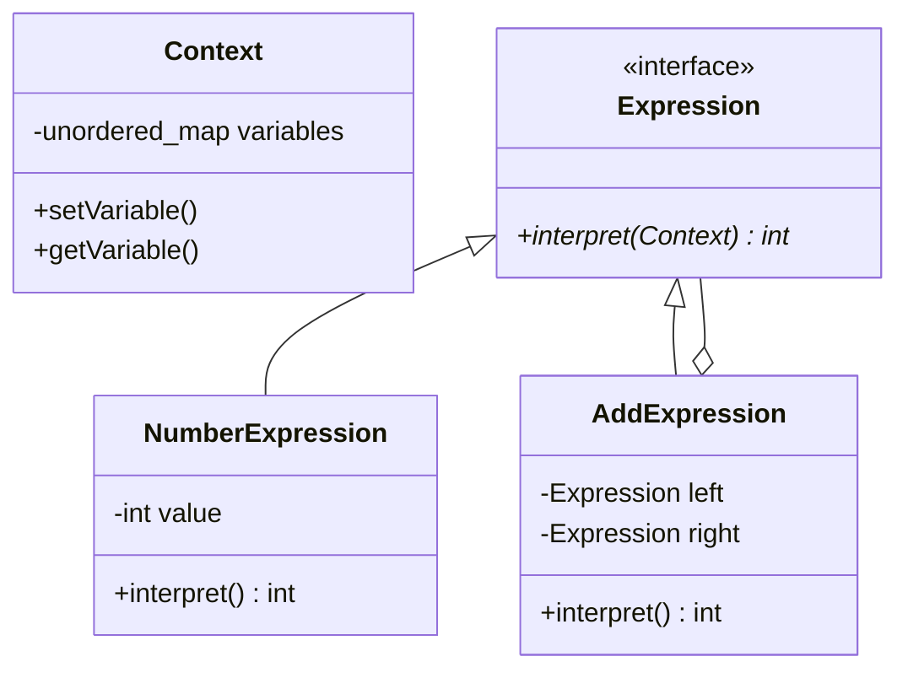
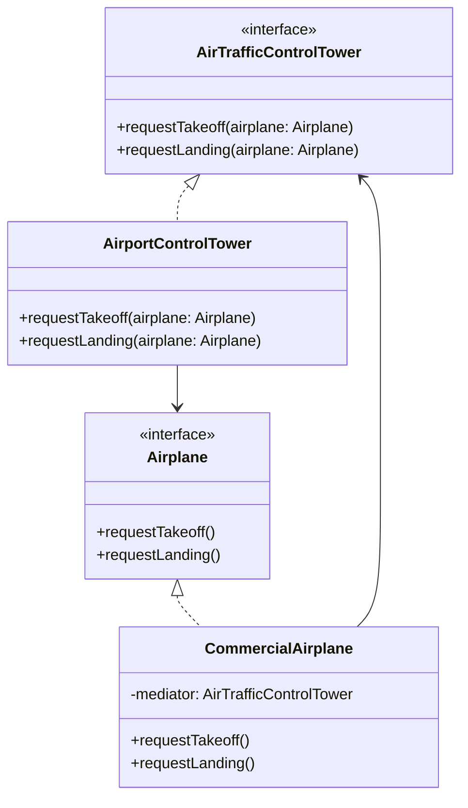

# CS202: Programming Systems (Class 25A02)
## AI Usage Declaration and AI Chat Log

**Institution:** VNUHCM - University of Science (HCMUS)  
**Department:** Faculty of Information Technology  
**Course:** CS202 - Programming Systems (25A02)  
**Topic:** Behavioral Design Patterns — Interpreter & Mediator Patterns (Reports 1 & 2)  
**Document Type:** AI Ethics Declaration & Interaction Log  

---

## PART 1: INTERPRETER DESIGN PATTERN (REPORT 1)

### 1. AI Usage Declaration

#### 1.1 Academic Integrity Statement
In compliance with the academic integrity guidelines of the Faculty of Information Technology at VNUHCM - University of Science (HCMUS) for course **CS202: Programming Systems**, we hereby declare our usage of Artificial Intelligence (AI) assistance in the preparation, implementation, and documentation of the **Interpreter Design Pattern (Report 1)**.

AI tools (such as Google Gemini and ChatGPT) were utilized strictly as **assistive tools** for brainstorming, syntax boilerplate generation, Mermaid UML code drafting, and English technical writing refinement. All core software architectures, algorithm designs, C++ code verification, debugging, and critical evaluations were performed and verified manually by the team members.

---

#### 1.2 Breakdown of AI Assistance by Role & Task

Per the team's initial workflow plan (`seminar_plan.md`), task responsibilities and AI utilization are detailed below:

| Team Member | Student ID | Assigned Tasks | Permitted AI Assistance Scope | Human Verification & Ownership |
| :--- | :--- | :--- | :--- | :--- |
| **Trần Thành Lợi** | `25125059` | Tasks 4, 5, 6, 7 (AST Design, UML Diagrams, Modern C++ Implementation, Report Lead) | - Generating Mermaid UML syntax templates.<br>- Scaffolding standard C++ header/source file layouts.<br>- Refining technical English phrasing in structural report sections. | - Designed the AST composite architecture and memory management (`std::shared_ptr`).<br>- Hand-wrote and compiled C++ implementation (`main_pattern.cpp`).<br>- Validated UML correctness against GoF standards. |
| **Huỳnh Trần Gia Hân** | `25125042` | Tasks 1, 2, 3, 8, 9, 10 (Problem Context, Naive Code, Flaws Analysis, Pros/Cons, Applications, Quiz) | - Drafting initial procedural string parser boilerplate.<br>- Brainstorming real-world applications (e.g., SQL engines, Regex).<br>- Formatting multiple-choice review questions. | - Formulated the real-world mathematical expression problem context.<br>- Conducted architectural flaw analysis (SOLID violations).<br>- Curated and validated the quiz questions and answers. |

---

### 2. Summarized AI Chat Log

Below is the structured transcript of key prompts and responses exchanged with the AI assistant during the project development phases.

---

#### Phase 1: Problem Formulation & Naive Solution (Tasks 1, 2, 3)
*Assigned to: Huỳnh Trần Gia Hân (`25125042`)*

##### **User Prompt 1.1 (Naive C++ Implementation):**
> *"I need a quick procedural C++ function that takes a mathematical string expression like `'3 + 5 - 2'`, splits it by spaces, and evaluates it sequentially using `if-else` statements. Keep it simple for a naive solution comparison."*

##### **AI Response Summary:**
```cpp
int evaluateNaive(const std::string& expression) {
    std::stringstream ss(expression);
    std::vector<std::string> tokens;
    std::string token;
    while (ss >> token) tokens.push_back(token);
    
    int result = std::stoi(tokens[0]);
    for (size_t i = 1; i < tokens.size(); i += 2) {
        std::string op = tokens[i];
        int nextVal = std::stoi(tokens[i+1]);
        if (op == "+") result += nextVal;
        else if (op == "-") result -= nextVal;
    }
    return result;
}
```

##### **Human Refinement:**
- Added error handling for malformed input tokens and out-of-bound string formats.
- Documented explicit architectural critique explaining why sequential parsing fails when operator precedence (`*`, `/`) or nested parentheses `()` are introduced.

---

#### Phase 2: Pattern Architecture & UML Diagrams (Tasks 4, 5, 6)
*Assigned to: Trần Thành Lợi (`25125059`)*

##### **User Prompt 2.1 (Mermaid Diagram for AST):**
> *"Generate a Mermaid `classDiagram` for the Interpreter pattern applied to arithmetic expressions with `Expression` base class, `NumberExpression` terminal node, and `AddExpression` / `SubtractExpression` nonterminal nodes. Include `Context` for variables."*

##### **AI Response Summary:**


##### **Human Refinement:**
- Adjusted Mermaid syntax to explicitly reflect modern C++ `std::shared_ptr<Expression>` smart pointer composition.
- Added variable binding constructor overloads to `NumberExpression` to allow symbol resolution (e.g., lookup `"a"` or `"b"` in `Context`).

---

#### Phase 3: Modern C++ Implementation Layout (Task 7)
*Assigned to: Trần Thành Lợi (`25125059`)*

##### **User Prompt 3.1 (Header & Source Modular Layout):**
> *"Help me structure modern C++ classes for the Interpreter pattern across clean header files (`Context.h`, `Expression.h`, `NumberExpression.h`, `AddExpression.h`, `SubtractExpression.h`) using `std::shared_ptr` and `#pragma once`."*

##### **AI Response Summary:**
Generated modular C++ code snippets for each header file with virtual destructors and const-correct `interpret(Context& context) const override` methods.

##### **Human Refinement:**
- Verified compilation under C++20 (`g++ -std=c++20 main_pattern.cpp`).
- Designed the dynamic expression parser routine (`parseExpression`) in `main_pattern.cpp` to construct an Abstract Syntax Tree from input string tokens dynamically.

---

#### Phase 4: Applications, Pros/Cons & Quiz Formatting (Tasks 8, 9, 10)
*Assigned to: Huỳnh Trần Gia Hân (`25125042`)*

##### **User Prompt 4.1 (Real-world Applications & Quiz):**
> *"List 4 real-world software applications of the Interpreter pattern (e.g. SQL, regex) and create 5 multiple-choice questions for a student presentation."*

##### **AI Response Summary:**
Provided application domain bullet points (SQL AST, `std::regex` engine, Business Rule Engines, DSL config parsing) and generated 5 multiple-choice questions with answer keys.

##### **Human Refinement:**
- Customized quiz questions to align directly with CS202 lecture topics (focusing on AST node separation, GoF definitions, Visitor pattern pairing, and memory overhead trade-offs).

---

## PART 2: MEDIATOR DESIGN PATTERN (REPORT 2)

### 1. AI Usage Declaration

#### 1.1 Academic Integrity Statement
In compliance with the academic integrity guidelines of the Faculty of Information Technology at VNUHCM - University of Science (HCMUS) for course **CS202: Programming Systems**, we hereby declare our usage of Artificial Intelligence (AI) assistance in the preparation, implementation, and documentation of the **Mediator Design Pattern (Report 2)**.

AI tools (such as Google Gemini and ChatGPT) were utilized strictly as **assistive tools** for brainstorming architectural concepts, generating initial C++ boilerplates for naive and decoupled airspace models, drafting Mermaid UML diagrams, and structured report compilation. All final source code verification, design decisions regarding registration and object coordination flow, compilation, testing, and debugging were performed manually by the team members.

---

#### 1.2 Breakdown of AI Assistance by Role & Task

Per the team's workflow plan, task responsibilities and AI utilization for the Mediator pattern are detailed below:

| Team Member | Student ID | Assigned Tasks | Permitted AI Assistance Scope | Human Verification & Ownership |
| :--- | :--- | :--- | :--- | :--- |
| **Huỳnh Trần Gia Hân** | `25125042` | Tasks 1-10 (All) | - Structuring class relationships inside Mediator UML diagrams.<br>- Scaffolding standard C++ Mediator and Colleague polymorphic linkages.<br>- Refining structural descriptions of tower notifications.<br>- Drafting the quadratic $O(N^2)$ direct-mesh C++ flight comparison boilerplate.<br>- Formulating quiz questions regarding "God Object" and temporal coupling risks. | - Designed the airspace subscription model and coordination flow in `AirportControlTower`.<br>- Hand-wrote and compiled the final decoupled C++ implementation (`MediatorPattern.cpp`).<br>- Ensured appropriate virtual destructor handling.<br>- Formulated the real-world terminal airspace collision and coordination problem context.<br>- Analyzed coupling flaws inside the naive flight control system.<br>- Verified and structured the quiz questions and answers. |
| **Trần Thành Lợi** | `25125059` | Quality Assurance | - Grammar, phrasing, and formatting checks for the final report submission. | - Conducted full code review and verified runtime execution of C++ source files.<br>- Reviewed UML design correctness, evaluated trade-offs, and verified the quiz accuracy. |

---

### 2. Summarized AI Chat Log

Below is the structured transcript of key prompts and responses exchanged with the AI assistant during the Mediator Pattern development.

---

#### Phase 1: Problem Formulation & Naive ATC Solution (Tasks 1, 2, 3)

##### **User Prompt 1.1 (ATC Naive Mesh C++):**
> *"Help me write a naive C++ solution representing an Air Traffic Control system. Multiple flight aircraft need to request landing clearance. Make them communicate directly with all other aircraft to simulate an O(N^2) connection mesh. Let each plane have a vector of other aircraft pointers."*

##### **AI Response Summary:**
Generated a class `Aircraft` having `std::vector<Aircraft*> otherAircrafts`. When calling `requestLanding()`, it loops over `otherAircrafts` and calls `giveClearance()`. In `main()`, every flight manually adds pointers to every other flight.

##### **Human Refinement:**
- Optimized the connection instantiation logic inside `main()`.
- Wrote architectural evaluation highlights demonstrating how adding a single plane scales badly since it requires modifying all pre-existing planes' dependency tables.

---

#### Phase 2: Pattern Architecture & UML Diagrams (Tasks 4, 5, 6)

##### **User Prompt 2.1 (Mermaid Diagram for ATC Mediator):**
> *"Generate a Mermaid classDiagram mapping the Mediator pattern onto an Air Traffic Control context. The classes should include AirTrafficControlTower as the Mediator interface, AirportControlTower as the concrete mediator, Airplane as the Colleague base, and CommercialAirplane as a concrete colleague. Show references and coordinates links."*

##### **AI Response Summary:**


##### **Human Refinement:**
- Restructured diagram dependencies to ensure `AirportControlTower` correctly aggregates and coordinates references of `Airplane` instances.
- Extended the concrete colleagues in the report to include `CargoAirplane` and `PrivateJet` to match the naive code implementation.

---

#### Phase 3: Decoupled C++ Implementation (Task 7)

##### **User Prompt 3.1 (Modern C++ Mediator Pattern Implementation):**
> *"Translate the Air Traffic Control Mediator design into clean modern C++ code. The central control tower should act as the mediator. Airplanes should register with the tower, and when one requests landing/takeoff, the tower must issue instructions (e.g. hold position, maintain altitude) to all other airplanes."*

##### **AI Response Summary:**
Generated a C++ implementation with abstract `AirTrafficControlTower`, abstract `Airplane`, concrete `AirportControlTower` storing `std::vector<Airplane*>`, and three concrete colleague implementations (`CommercialAirplane`, `CargoAirplane`, `PrivateJet`) delegating landing and takeoff operations to the tower pointer.

##### **Human Refinement:**
- Hand-wrote code additions to compile and execute locally under the visual terminal.
- Added virtual destructors to prevent resource leaks during cleanup.
- Standardized command output logging formats to visually represent messages passing through the control tower.

---

#### Phase 4: Applications, Trade-offs & Quiz Verification (Tasks 8, 9, 10)


##### **User Prompt 4.1 (Real-world applications and Quiz):**
> *"List real-world applications of Mediator pattern in web, mobile, and distributed systems. Generate a 6-question quiz about temporal coupling, SRP/OCP, and God Object risks for Mediator."*

##### **AI Response Summary:**
Provided web (Dialog Box, CQRS MediatR), mobile (Router/Coordinator), and distributed (Chat server hub) application scenarios, along with 6 multiple-choice questions with answer key.

##### **Human Refinement:**
- Refined quiz options to focus heavily on the mathematical and computational trade-offs ($O(N^2)$ to $O(N)$ connection reduction) and potential drawbacks such as Single Point of Failure (SPOF) and routing bottlenecks.

---

## 3. Team Verification & Approval

We confirm that all code, text, diagrams, and analysis included in the submission files have been thoroughly reviewed, compiled, tested, and validated by both team members.