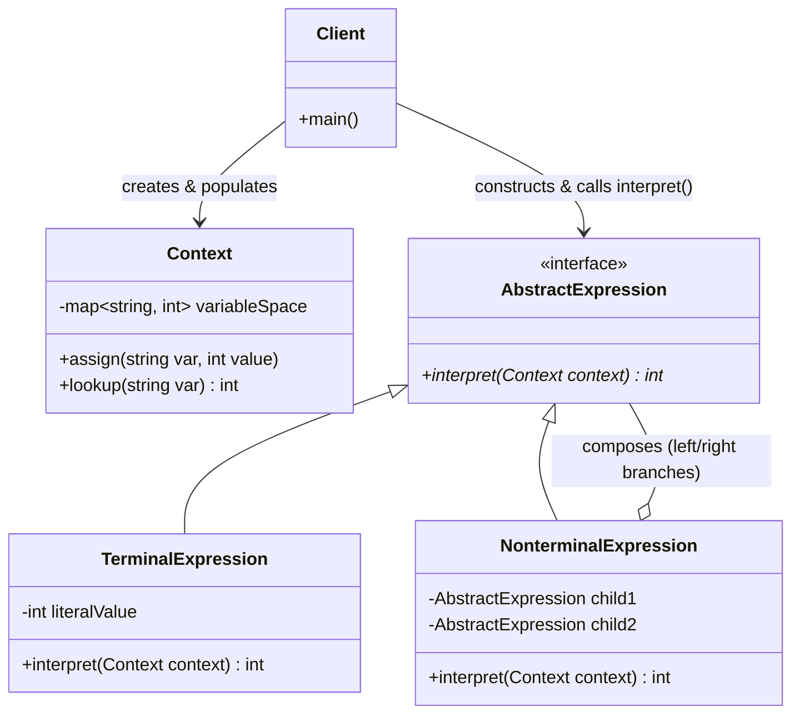
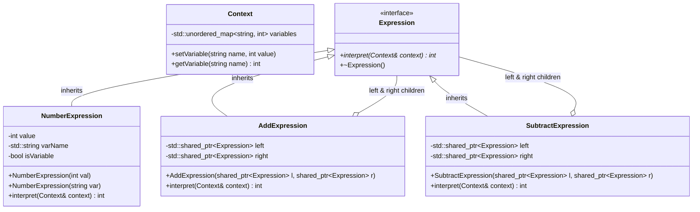

# CS202: Programming Systems (Class 25A02)
## Report 1: The Interpreter Design Pattern

**Institution:** VNUHCM - University of Science (HCMUS)  
**Department:** Faculty of Information Technology  
**Course:** CS202 - Programming Systems (25A02)  
**Topic:** Behavioral Design Pattern — Interpreter Pattern  
**Document Type:** Technical Seminar & Implementation Report  

---

### Team Members & Role Division

| Student Name | Student ID | Assigned Tasks | Responsibilities & Contribution |
| :--- | :--- | :--- | :--- |
| **Trần Thành Lợi** | `25125059` | Tasks 4, 5, 6, 7 | **Lead Report Author & Core Architect:** AST Design, Class Diagrams, Modern C++ Implementation (`main_pattern.cpp`, Header/Source layout), AST Evaluation Logic. |
| **Huỳnh Trần Gia Hân** | `25125043` | Tasks 1, 2, 3, 8, 9, 10 | **Problem Analyst & Domain Evaluator:** Problem Statement, Naive Solution (`main_naive.cpp`), Architectural Flaws Analysis, Pros/Cons, Real-World Applications, Interactive Quiz. |

---

## Table of Contents
1. [Real-World Problem Context](#1-real-world-problem-context)
2. [Naive Solution & C++ Implementation](#2-naive-solution--c-implementation)
3. [Architectural Flaws of the Naive Approach](#3-architectural-flaws-of-the-naive-approach)
4. [Theoretical Foundation of the Interpreter Pattern](#4-theoretical-foundation-of-the-interpreter-pattern)
5. [Generic Interpreter Pattern Class Diagram](#5-generic-interpreter-pattern-class-diagram)
6. [Domain-Specific Design & AST Class Diagram](#6-domain-specific-design--ast-class-diagram)
7. [Comprehensive C++ Modern Implementation](#7-comprehensive-c-modern-implementation)
8. [Pros, Cons, and Design Trade-offs](#8-pros-cons-and-design-trade-offs)
9. [Real-World Applications & Industry Use Cases](#9-real-world-applications--industry-use-cases)
10. [Interactive Self-Assessment Quiz](#10-interactive-self-assessment-quiz)

---

## 1. Real-World Problem Context

In computer software development, evaluating dynamic, user-defined expressions at runtime is a frequent requirement. Consider a enterprise financial application, a spreadsheet program, or a dynamic rule engine where end-users type string-based mathematical or logical formulas such as:

$$	ext{Result} = "3 + 5 - 2"$$

or dynamic expressions involving variable lookups:

$$	ext{Tax} = 	ext{"base\_salary"} + 	ext{"bonus"} - 	ext{"deduction"}$$

Hardcoding these equations into static C++ code using native arithmetic operators (e.g., `int result = 3 + 5 - 2;`) is impossible because the formulas are not known at compile-time—they are provided dynamically by external users, configurations, or network payloads.

To process these dynamic inputs, the software system must parse the input string, interpret the tokens (numbers, variables, operators), respect operator precedence and nested grouping, and compute the final numeric value. 

---

## 2. Naive Solution & C++ Implementation

A common initial approach to solving this problem without applying behavioral design patterns is using procedural string parsing. Developers typically split the string input by whitespace and iterate through the tokens sequentially using conditional statements (`if-else` or `switch-case`).

### Naive Implementation (`src/main_naive.cpp`)

```cpp
#include <iostream>
#include <string>
#include <sstream>
#include <vector>

// Naive expression evaluator using sequential parsing and dynamic branching
int evaluateNaive(const std::string& expression) {
    std::stringstream ss(expression);
    std::vector<std::string> tokens;
    std::string token;
    
    while (ss >> token) {
        tokens.push_back(token);
    }
    
    if (tokens.empty()) return 0;
    
    // Accumulate result sequentially from left to right
    int result = std::stoi(tokens[0]);
    
    for (size_t i = 1; i < tokens.size(); i += 2) {
        std::string op = tokens[i];
        if (i + 1 >= tokens.size()) {
            std::cerr << "Error: Malformed expression format.
";
            return result;
        }
        int nextValue = std::stoi(tokens[i + 1]);
        
        if (op == "+") {
            result += nextValue;
        } else if (op == "-") {
            result -= nextValue;
        } else {
            std::cerr << "Error: Unsupported operator '" << op << "'
";
        }
    }
    
    return result;
}

int main() {
    std::string expr1 = "3 + 5 - 2";
    std::cout << "Evaluating '" << expr1 << "' -> Result: " 
              << evaluateNaive(expr1) << " (Expected: 6)
";
              
    return 0;
}
```

---

## 3. Architectural Flaws of the Naive Approach

While the naive approach works for trivial left-to-right calculations like `"3 + 5 - 2"`, it collapses under real-world engineering requirements due to severe structural limitations:

1. **Violation of the Open/Closed Principle (OCP):**
   Adding new operators (e.g., multiplication `*`, division `/`, modulo `%`, or exponentiation `^`) requires directly modifying the core loop inside `evaluateNaive()`. The function grows monotonically into a monolithic block of conditionals.

2. **Inability to Handle Operator Precedence:**
   Sequential evaluation treats `"3 + 5 * 2"` as $(3 + 5) 	imes 2 = 16$, which yields a mathematically incorrect result. Standard arithmetic rules demand that multiplication takes precedence ($3 + (5 	imes 2) = 13$). Adding precedence rules to procedural loops requires complex state tracking or nested regex hacks.

3. **Inability to Handle Nested Grouping (Parentheses):**
   Evaluating sub-expressions enclosed in parentheses, such as `"(3 + 5) * (10 - 2)"`, requires recursion or stack management. Iterative sequential string parsing becomes extremely fragile, messy, and prone to runtime bugs.

4. **Monolithic Responsibility (SRP Violation):**
   The naive function combines lexical analysis (tokenization), syntax validation, precedence handling, variable resolution, and evaluation into a single routine.

---

## 4. Theoretical Foundation of the Interpreter Pattern

### 4.1 Concept and Core Intent
The **Interpreter Design Pattern** is a **behavioral pattern** defined by GoF (Gang of Four). Its primary intent is:
> *Given a language, define a representation for its grammar along with an interpreter that uses the representation to interpret sentences in the language.*

Instead of viewing an equation as a raw string, the Interpreter pattern models the language's grammar as a hierarchy of classes, forming an **Abstract Syntax Tree (AST)**. Each node in the AST is an object representing a grammatical rule.

### 4.2 Key Components
- **AbstractExpression:** Declares an abstract `interpret(Context)` interface common to all nodes in the syntax tree.
- **TerminalExpression:** Implements `interpret()` for literal tokens that cannot be further decomposed (e.g., numerical constants like `3`, `5`, or variable symbols). These are the leaf nodes of the AST.
- **NonterminalExpression:** Implements `interpret()` for composite grammatical rules (e.g., `AddExpression`, `SubtractExpression`). A nonterminal node contains references to child `AbstractExpression` objects and recursively evaluates them.
- **Context:** Holds global information outside the AST, such as variable-to-value symbol tables (e.g., `x = 10`, `y = 5`).
- **Client:** Builds (or uses a Parser to build) the AST structure and invokes `interpret(Context)` on the root node.

---

## 5. Generic Interpreter Pattern Class Diagram



---

## 6. Domain-Specific Design & AST Class Diagram

To solve our string evaluation problem, we map mathematical grammar into concrete classes:

- **Grammar Rule:**
  $$	ext{Expression} ::= 	ext{Number} \mid 	ext{Expression} + 	ext{Expression} \mid 	ext{Expression} - 	ext{Expression}$$

### Expression Tree Representation for `"3 + 5 - 2"`
The string `"3 + 5 - 2"` (interpreted left-associatively as `(3 + 5) - 2`) forms the following AST:

```text
               SubtractExpression (-)
                     /                 AddExpression (+)   NumberExpression (2)
             /       NumberExpression(3)  NumberExpression(5)
```

### UML Class Diagram for Math Expression Evaluator



---

## 7. Comprehensive C++ Modern Implementation

Below is the modular, clean C++20 standard implementation organized per the seminar project structure:

```text
02_Interpreter_Pattern/
├── include/
│   ├── Context.h
│   ├── Expression.h
│   ├── NumberExpression.h
│   ├── AddExpression.h
│   └── SubtractExpression.h
└── src/
    ├── main_naive.cpp
    └── main_pattern.cpp
```

### 7.1 `include/Context.h`
```cpp
#pragma once
#include <string>
#include <unordered_map>
#include <stdexcept>

// Holds global context such as variable bindings
class Context {
private:
    std::unordered_map<std::string, int> variables;

public:
    void setVariable(const std::string& name, int value) {
        variables[name] = value;
    }

    int getVariable(const std::string& name) const {
        auto it = variables.find(name);
        if (it != variables.end()) {
            return it->second;
        }
        throw std::runtime_error("Undefined variable: " + name);
    }
};
```

### 7.2 `include/Expression.h`
```cpp
#pragma once
#include <memory>
#include "Context.h"

// Abstract Base Class representing a grammar node in the AST
class Expression {
public:
    virtual ~Expression() = default;
    virtual int interpret(Context& context) const = 0;
};
```

### 7.3 `include/NumberExpression.h`
```cpp
#pragma once
#include "Expression.h"
#include <string>

// Terminal Expression representing constant values or variables
class NumberExpression : public Expression {
private:
    int value{0};
    std::string varName;
    bool isVariable{false};

public:
    explicit NumberExpression(int val) : value(val), isVariable(false) {}
    explicit NumberExpression(std::string name) : varName(std::move(name)), isVariable(true) {}

    int interpret(Context& context) const override {
        if (isVariable) {
            return context.getVariable(varName);
        }
        return value;
    }
};
```

### 7.4 `include/AddExpression.h`
```cpp
#pragma once
#include "Expression.h"

// Nonterminal Expression representing Addition (+)
class AddExpression : public Expression {
private:
    std::shared_ptr<Expression> left;
    std::shared_ptr<Expression> right;

public:
    AddExpression(std::shared_ptr<Expression> l, std::shared_ptr<Expression> r)
        : left(std::move(l)), right(std::move(r)) {}

    int interpret(Context& context) const override {
        return left->interpret(context) + right->interpret(context);
    }
};
```

### 7.5 `include/SubtractExpression.h`
```cpp
#pragma once
#include "Expression.h"

// Nonterminal Expression representing Subtraction (-)
class SubtractExpression : public Expression {
private:
    std::shared_ptr<Expression> left;
    std::shared_ptr<Expression> right;

public:
    SubtractExpression(std::shared_ptr<Expression> l, std::shared_ptr<Expression> r)
        : left(std::move(l)), right(std::move(r)) {}

    int interpret(Context& context) const override {
        return left->interpret(context) - right->interpret(context);
    }
};
```

### 7.6 `src/main_pattern.cpp`
```cpp
#include <iostream>
#include <memory>
#include <vector>
#include <sstream>
#include "../include/Context.h"
#include "../include/Expression.h"
#include "../include/NumberExpression.h"
#include "../include/AddExpression.h"
#include "../include/SubtractExpression.h"

// Helper Parser function to convert tokenized input into an AST
std::shared_ptr<Expression> parseExpression(const std::string& exprStr) {
    std::stringstream ss(exprStr);
    std::string token;
    
    std::shared_ptr<Expression> currentRoot = nullptr;
    std::string currentOp = "";

    while (ss >> token) {
        if (token == "+" || token == "-") {
            currentOp = token;
        } else {
            // Check if token is a number or variable
            std::shared_ptr<Expression> numberNode;
            try {
                int val = std::stoi(token);
                numberNode = std::make_shared<NumberExpression>(val);
            } catch (...) {
                numberNode = std::make_shared<NumberExpression>(token);
            }

            if (!currentRoot) {
                currentRoot = numberNode;
            } else {
                if (currentOp == "+") {
                    currentRoot = std::make_shared<AddExpression>(currentRoot, numberNode);
                } else if (currentOp == "-") {
                    currentRoot = std::make_shared<SubtractExpression>(currentRoot, numberNode);
                }
            }
        }
    }
    return currentRoot;
}

int main() {
    std::cout << "====================================================
";
    std::cout << " CS202 - Interpreter Pattern Demo (Modern C++)
";
    std::cout << "====================================================

";

    Context ctx;
    ctx.setVariable("a", 10);
    ctx.setVariable("b", 4);

    // Test Case 1: Simple numerical expression "3 + 5 - 2"
    std::string str1 = "3 + 5 - 2";
    auto ast1 = parseExpression(str1);
    if (ast1) {
        std::cout << "[Test 1] Expression: "" << str1 << ""
";
        std::cout << "         Evaluated Result: " << ast1->interpret(ctx) 
                  << " (Expected: 6)

";
    }

    // Test Case 2: Expression with variables "a + b - 3"
    std::string str2 = "a + b - 3";
    auto ast2 = parseExpression(str2);
    if (ast2) {
        std::cout << "[Test 2] Context Variables: a = 10, b = 4
";
        std::cout << "         Expression: "" << str2 << ""
";
        std::cout << "         Evaluated Result: " << ast2->interpret(ctx) 
                  << " (Expected: 11)

";
    }

    return 0;
}
```

---

## 8. Pros, Cons, and Design Trade-offs

### Advantages
1. **Extensibility (Adherence to OCP):**
   Adding a new grammar rule or operator (e.g., `MultiplyExpression`) only requires creating a new class implementing `Expression`. Existing node classes remain completely untouched.
2. **Clear Separation of Concerns (SRP):**
   Each node class strictly handles the evaluation logic for its own specific operator or operand.
3. **Flexibility:**
   Easily modified at runtime. Trees can be dynamically manipulated, optimized, or transformed before evaluation.

### Disadvantages & Trade-offs
1. **Class Explosion for Complex Grammars:**
   If a grammar has 50 rules, you need 50 distinct classes. For large, complex languages (like full C++ or SQL), the Interpreter pattern becomes unmaintainable.
2. **Performance Overhead:**
   Deep syntax trees require extensive dynamic allocations, virtual function calls, and tree traversals, leading to CPU pointer chasing and cache misses compared to bytecode interpreters.

### Comparison Table

| Dimension | Naive Procedural Solution | Interpreter Pattern | Parser Generator / Bytecode (e.g. ANTLR) |
| :--- | :--- | :--- | :--- |
| **Complexity** | Low initially, exponential later | Moderate, highly modular | High setup overhead |
| **OCP Compliance** | Poor (modifies existing logic) | Excellent (add new class) | Excellent (grammar rules) |
| **Performance** | High for simple operations | Lower (virtual function calls) | Highest (optimized engine) |
| **Best Suited For** | Fixed trivial strings | Simple DSLs / Rule Evaluators | Complex programming languages |

---

## 9. Real-World Applications & Industry Use Cases

1. **Database Query Engines (SQL Parsers):**
   Database management systems convert SQL strings (`SELECT * FROM users WHERE age > 18`) into an execution AST where nodes interpret filtering criteria.
2. **Regular Expressions (`std::regex`):**
   Regex engines compile expression strings like `^[a-z0-9]+@[a-z]+\.com$` into terminal and nonterminal matcher states that interpret target strings.
3. **Business Rule Engines:**
   Financial and insurance software use the Interpreter pattern to allow business analysts to define dynamic risk formulas or tax rule trees at runtime.
4. **Domain-Specific Languages (DSLs) & Config Files:**
   Tools like Ansible, Terraform (HCL), or custom game scripting engines interpret dynamic script nodes.

---

## 10. Interactive Self-Assessment Quiz

### Question 1
**What is the primary objective of the Interpreter Design Pattern?**  
A. To convert an object's interface into another interface expected by clients.  
B. Given a language, to define a class-based grammar representation and an interpreter to evaluate sentences.  
C. To decouple an abstraction from its implementation so that two can vary independently.  
D. To ensure a class has only one instance and provide a global point of access to it.  

*Answer:* **B** — The core definition of the Interpreter pattern is defining a grammar representation and evaluating sentences within that language.

---

### Question 2
**In the context of the Interpreter Pattern, what constitutes a `TerminalExpression`?**  
A. A node that contains child expressions and performs binary operations.  
B. A leaf node in the AST that represents literal values or variables and cannot be divided further.  
C. The root class that coordinates execution across all threads.  
D. A class responsible for parsing the input string into tokens.  

*Answer:* **B** — Terminal expressions represent atomic elements (literals/variables) at the leaves of the AST.

---

### Question 3
**Which GoF design pattern is frequently combined with the Interpreter pattern to traverse and evaluate AST nodes without polluting node classes?**  
A. Singleton Pattern  
B. Visitor Pattern  
C. Factory Method Pattern  
D. Adapter Pattern  

*Answer:* **B** — The Visitor Pattern allows external operations to be executed over AST nodes without adding evaluation code into the node classes themselves.

---

### Question 4
**What is the main reason NOT to use the Interpreter Pattern for full production programming languages (like C++ or Java)?**  
A. It cannot handle numbers.  
B. It causes class explosion and severe memory/performance overhead due to excessive virtual calls on deep trees.  
C. It violates the Single Responsibility Principle.  
D. Modern compilers do not use trees.  

*Answer:* **B** — Complex grammars result in hundreds of classes and deep ASTs, making pure object-oriented interpretation inefficient compared to bytecode VM approaches.

---

### Question 5
**In our C++ implementation, what purpose does the `Context` class serve?**  
A. It holds state global to the evaluation, such as variable-to-value symbol mapping.  
B. It acts as the base class for all operators.  
C. It tokenizes raw string inputs into vectors.  
D. It deletes unused AST nodes automatically.  

*Answer:* **A** — `Context` stores state outside the AST itself, such as variable tables needed during interpretation.

---

## Summary & Group Conclusion
The **Interpreter Design Pattern** offers an elegant, object-oriented framework for parsing and evaluating domain-specific languages and dynamic expressions. While not intended for high-performance compiler backends of complex languages, its modularity and strict adherence to SOLID principles make it the ideal design choice for rule engines, mathematical formula evaluators, and configuration parsers.
