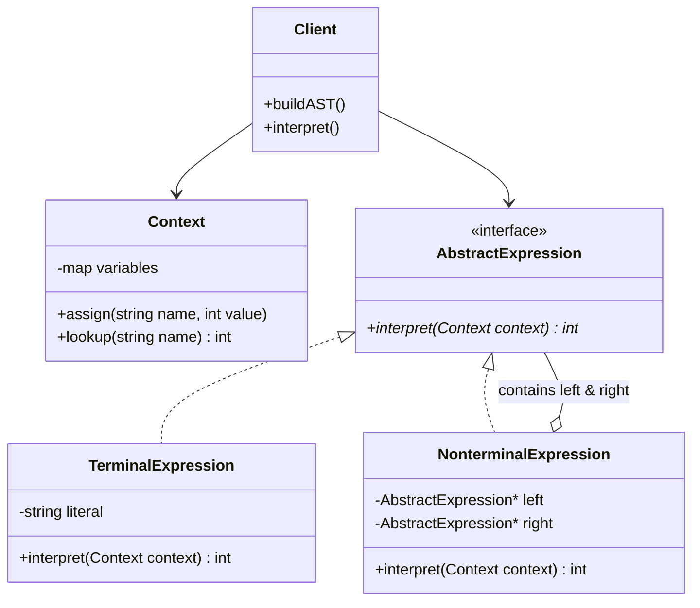
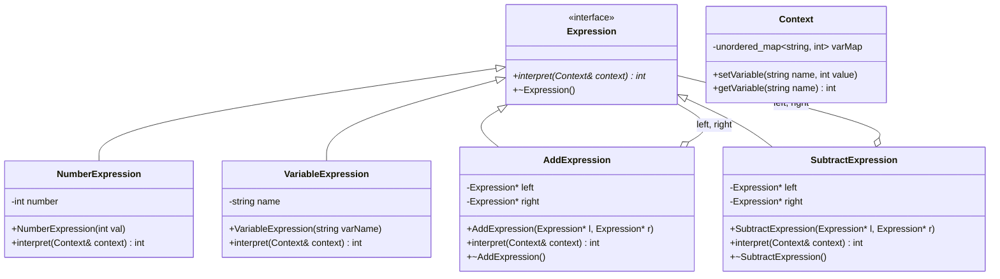

# TRƯỜNG ĐẠI HỌC KHOA HỌC TỰ NHIÊN - ĐHQG-HCM
## KHOA CÔNG NGHỆ THÔNG TIN
### MÔN HỌC: CS202 - PROGRAMMING SYSTEMS (LỚP: 25A02)

---

# BÁO CÁO SEMINAR DESIGN PATTERNS: INTERPRETER PATTERN
**Học kỳ I - Năm học 2025 - 2026**

* **Chủ đề:** Behavioral Design Patterns - Interpreter Pattern
* **Mã môn học:** CS202
* **Tên môn học:** Programming Systems
* **Lớp:** 25A02
* **Đơn vị:** Trường Đại học Khoa học Tự nhiên, Đại học Quốc gia TP.HCM (HCMUS)

### **Thông tin thành viên nhóm:**
1. **Trần Thành Lợi** - MSSV: `25125059` (Dev A - Phụ trách Cấu trúc AST, Diagram, Mã nguồn Pattern, Tổng hợp Report)
2. **Huỳnh Trần Gia Hân** - MSSV: `25125043` (Dev B - Phụ trách Đặt vấn đề, Giải pháp Naive, Đánh giá Ưu/Nhược điểm, Quiz)

---

## MỤC LỤC
1. [Đặt Vấn Đề (Problem Statement)](#1-đặt-vấn-đề-problem-statement)
2. [Giải Pháp Thô (Naive Approach) & Mã Nguồn C++](#2-giải-pháp-thô-naive-approach--mã-nguồn-c)
3. [Phân Tích Khuyết Điểm Của Giải Pháp Thô](#3-phân-tích-khuyết-điểm-của-giải-pháp-thô)
4. [Bản Chất Lý Thuyết Của Interpreter Pattern](#4-bản-chất-lý-thuyết-của-interpreter-pattern)
5. [Sơ Đồ Lớp Tổng Quát (General Class Diagram)](#5-sơ-đồ-lớp-tổng-quát-general-class-diagram)
6. [Sơ Đồ Lớp Áp Dụng Cụ Thể (Specific Class Diagram)](#6-sơ-đồ-lớp-áp-dụng-cụ-thể-specific-class-diagram)
7. [Hiện Thực Mã Nguồn C++ Chuẩn Design Pattern](#7-hiện-thực-mã-nguồn-c-chuẩn-design-pattern)
8. [Đánh Giá Ưu Điểm & Nhược Điểm (Pros & Cons)](#8-đánh-giá-ưu-điểm--nhược-điểm-pros--cons)
9. [Ứng Dụng Thực Tế (Real-World Applications)](#9-ứng-dụng-thực-tế-real-world-applications)
10. [Bộ Câu Hỏi Ôn Tập & Củng Cố (Quiz)](#10-bộ-câu-hỏi-ôn-tập--củng-cố-quiz)

---

## 1. Đặt Vấn Đề (Problem Statement)

Trong phát triển phần mềm, chúng ta thường xuyên gặp phải bài toán xử lý và đánh giá các biểu thức dạng chuỗi kí tự (String). Các bài toán này xuất hiện phổ biến trong nhiều ứng dụng:
- Máy tính bỏ túi hoặc trình tính toán biểu thức đại số.
- Trình phân tích cú pháp cho các ngôn ngữ truy vấn (SQL queries), biểu thức chính quy (Regular Expressions).
- Trình đánh giá quy tắc nghiệp vụ (Rule Engines) trong hệ thống tài chính, ngân hàng hay thương mại điện tử.

### Bài toán cụ thể:
Xây dựng một chương trình tính toán nhận đầu vào là một chuỗi biểu thức số học gồm các số nguyên, phép cộng (`+`), phép trừ (`-`), phép nhân (`*`), và có thể mở rộng cho các biến số (`x`, `y`, `z`) hoặc các toán tử phức tạp hơn.

**Ví dụ đầu vào:**
- Chuỗi biểu thức: `"3 + 5 - 2"` $
ightarrow$ Kết quả mong đợi: `6`
- Chuỗi biểu thức có biến: `"x + 10 - y"` với $x = 5, y = 3$ $
ightarrow$ Kết quả mong đợi: `12`

---

## 2. Giải Pháp Thô (Naive Approach) & Mã Nguồn C++

### Ý tưởng tiếp cận ban đầu:
Một lập trình viên khi chưa áp dụng Design Pattern thường sẽ xử lý bài toán này bằng cách cắt chuỗi (string parsing) bằng các hàm duyệt chuỗi thủ công, dùng vòng lặp `while`/`for` kết hợp với câu lệnh điều kiện `if-else` hoặc `switch-case` để nhận biết toán tử và số hạng, sau đó tính toán trực tiếp từ trái sang phải.

### Mã nguồn minh họa C++ (`main_naive.cpp`):

```cpp
#include <iostream>
#include <string>
#include <sstream>
#include <vector>

// Giải pháp Naive: Duyệt chuỗi và tính toán trực tiếp từ trái sang phải
int evaluateNaive(const std::string& expression) {
    std::stringstream ss(expression);
    int result = 0;
    int number = 0;
    char op = '+';

    while (ss >> number) {
        if (op == '+') {
            result += number;
        } else if (op == '-') {
            result -= number;
        } else if (op == '*') {
            result *= number;
        }
        
        // Đọc toán tử tiếp theo nếu còn
        if (!(ss >> op)) {
            break;
        }
    }
    return result;
}

int main() {
    std::string expr1 = "3 + 5 - 2";
    std::cout << "Gia tri cua '" << expr1 << "' la: " << evaluateNaive(expr1) << std::endl;

    std::string expr2 = "10 - 4 + 6";
    std::cout << "Gia tri cua '" << expr2 << "' la: " << evaluateNaive(expr2) << std::endl;

    return 0;
}
```

---

## 3. Phân Tích Khuyết Điểm Của Giải Pháp Thô

Mặc dù giải pháp thô (Naive Approach) hoạt động ổn định với các chuỗi đơn giản tính từ trái sang phải, nó bộc lộ những khuyết điểm kiến trúc vô cùng nghiêm trọng khi hệ thống phát triển:

1. **Khó xử lý thứ tự ưu tiên toán tử (Operator Precedence) và Dấu ngoặc:**
   - Trong toán học, phép nhân/chia (`*`, `/`) có độ ưu tiên cao hơn cộng/trừ (`+`, `-`). Dấu ngoặc `()` thay đổi thứ tự thực hiện. Cách tiếp cận duyệt chuỗi tuyến tính bằng `switch-case` không thể xử lý biểu thức phức tạp như `"3 + 5 * 2"` hoặc `"(3 + 5) * 2"` nếu không viết hàng loạt hàm đệ quy đan xen phức tạp (spaghetti code).

2. **Vi phạm nguyên lý SOLID:**
   - **Open/Closed Principle (OCP):** Khi muốn thêm một toán tử mới (ví dụ: phép chia `/`, phép lũy thừa `^`, hàm `mod`), chúng ta buộc phải sửa đổi trực tiếp logic của hàm `evaluateNaive`.
   - **Single Responsibility Principle (SRP):** Hàm `evaluateNaive` gánh vác quá nhiều trách nhiệm: vừa phân tích cú pháp (parsing), vừa quản lý thứ tự ưu tiên, vừa thực thi tính toán.

3. **Khó hỗ trợ ngữ cảnh biến số (Variable Context):**
   - Nếu biểu thức chứa biến số như `"x + y - 5"`, giải pháp thô phải liên tục tra cứu bảng băm (hashmap) bên trong vòng lặp xử lý chuỗi, dẫn đến mã nguồn bị rối loạn và rất khó kiểm thử độc lập (unit test).

---

## 4. Bản Chất Lý Thuyết Của Interpreter Pattern

### Khái niệm:
**Interpreter Pattern** là một mẫu thiết kế thuộc nhóm **Behavioral Patterns** (Mẫu hành vi) định nghĩa bởi Gang of Four (GoF). Mẫu này định nghĩa một biểu diễn ngữ pháp (Grammar Representation) cho một ngôn ngữ cụ thể, cùng với một trình thông dịch (Interpreter) sử dụng biểu diễn này để đánh giá/thực thi các câu hoặc biểu thức trong ngôn ngữ đó.

### Cấu trúc Ngữ pháp và Cây cú pháp trừu tượng (Abstract Syntax Tree - AST):
Interpreter Pattern hoạt động dựa trên việc biểu diễn ngữ pháp dưới dạng một **Cây cú pháp trừu tượng (AST)**:
- **Terminal Expression (Biểu thức kết thúc / Nút lá):** Đại diện cho các phần tử cơ bản không chứa biểu thức con (ví dụ: Số hằng `5`, `10`, hoặc Biến `x`).
- **Non-terminal Expression (Biểu thức phi kết thúc / Nút nhánh):** Đại diện cho các quy tắc kết hợp các biểu thức con (ví dụ: Phép cộng `AddExpression`, Phép trừ `SubtractExpression`). Nó chứa các con trỏ trỏ tới các `Expression` khác.

```text
       [ AddExpression ]   <--- Non-terminal (Root)
          /        \
  [ Number: 3 ]  [ SubtractExpression ]  <--- Non-terminal
                     /            \
             [ Number: 5 ]    [ Number: 2 ]  <--- Terminal (Leaves)
```

### Các thành phần chính trong Interpreter Pattern:
1. **AbstractExpression (`Expression`):** Định nghĩa interface chung với phương thức `interpret(Context)`.
2. **TerminalExpression (`NumberExpression`):** Cài đặt `interpret()` cho các phần tử lá, trả về giá trị thực tế hoặc giá trị biến từ Context.
3. **NonTerminalExpression (`AddExpression`, `SubtractExpression`):** Cài đặt `interpret()` bằng cách gọi đệ quy `interpret()` trên các biểu thức con và kết hợp kết quả theo quy tắc toán tử.
4. **Context (`Context`):** Chứa thông tin toàn cục hoặc trạng thái đầu vào (ví dụ: Bảng lưu trữ giá trị các biến số `x = 5`, `y = 10`).
5. **Client:** Dựng cây AST đại diện cho biểu thức và kích hoạt quá trình thông dịch bằng cách gọi `interpret()` tại nút gốc.

---

## 5. Sơ Đồ Lớp Tổng Quát (General Class Diagram)

Sơ đồ UML dưới đây thể hiện cấu trúc tổng quát của Interpreter Pattern:



---

## 6. Sơ Đồ Lớp Áp Dụng Cụ Thể (Specific Class Diagram)

Sơ đồ UML áp dụng cụ thể cho bài toán Trình tính toán biểu thức số học (`Expression Evaluator`):



---

## 7. Hiện Thực Mã Nguồn C++ Chuẩn Design Pattern

Toàn bộ mã nguồn được tổ chức theo chuẩn cấu trúc dự án C++ chuyên nghiệp:

### Cấu trúc thư mục:
```text
02_Interpreter_Pattern/
├── include/
│   ├── Context.h
│   ├── Expression.h
│   ├── NumberExpression.h
│   ├── VariableExpression.h
│   ├── AddExpression.h
│   └── SubtractExpression.h
└── src/
    ├── Context.cpp
    ├── NumberExpression.cpp
    ├── VariableExpression.cpp
    ├── AddExpression.cpp
    ├── SubtractExpression.cpp
    └── main_pattern.cpp
```

---

### Mã nguồn chi tiết:

#### 1. `include/Context.h` & `src/Context.cpp`
```cpp
// include/Context.h
#ifndef CONTEXT_H
#define CONTEXT_H

#include <string>
#include <unordered_map>
#include <stdexcept>

class Context {
private:
    std::unordered_map<std::string, int> varMap;
public:
    void setVariable(const std::string& name, int value) {
        varMap[name] = value;
    }

    int getVariable(const std::string& name) const {
        auto it = varMap.find(name);
        if (it != varMap.end()) {
            return it->second;
        }
        throw std::runtime_error("Bien chưa duoc dinh nghia: " + name);
    }
};

#endif
```

#### 2. `include/Expression.h`
```cpp
// include/Expression.h
#ifndef EXPRESSION_H
#define EXPRESSION_H

#include "Context.h"

// Interface chung cho tat ca các bieu thuc
class Expression {
public:
    virtual ~Expression() = default;
    virtual int interpret(const Context& context) const = 0;
};

#endif
```

#### 3. `include/NumberExpression.h` (Terminal Expression)
```cpp
// include/NumberExpression.h
#ifndef NUMBER_EXPRESSION_H
#define NUMBER_EXPRESSION_H

#include "Expression.h"

class NumberExpression : public Expression {
private:
    int number;
public:
    explicit NumberExpression(int val) : number(val) {}

    int interpret(const Context& context) const override {
        return number;
    }
};

#endif
```

#### 4. `include/VariableExpression.h` (Terminal Expression với Context)
```cpp
// include/VariableExpression.h
#ifndef VARIABLE_EXPRESSION_H
#define VARIABLE_EXPRESSION_H

#include "Expression.h"
#include <string>

class VariableExpression : public Expression {
private:
    std::string name;
public:
    explicit VariableExpression(std::string varName) : name(std::move(varName)) {}

    int interpret(const Context& context) const override {
        return context.getVariable(name);
    }
};

#endif
```

#### 5. `include/AddExpression.h` (Non-terminal Expression)
```cpp
// include/AddExpression.h
#ifndef ADD_EXPRESSION_H
#define ADD_EXPRESSION_H

#include "Expression.h"
#include <memory>

class AddExpression : public Expression {
private:
    std::unique_ptr<Expression> left;
    std::unique_ptr<Expression> right;
public:
    AddExpression(std::unique_ptr<Expression> l, std::unique_ptr<Expression> r)
        : left(std::move(l)), right(std::move(r)) {}

    int interpret(const Context& context) const override {
        return left->interpret(context) + right->interpret(context);
    }
};

#endif
```

#### 6. `include/SubtractExpression.h` (Non-terminal Expression)
```cpp
// include/SubtractExpression.h
#ifndef SUBTRACT_EXPRESSION_H
#define SUBTRACT_EXPRESSION_H

#include "Expression.h"
#include <memory>

class SubtractExpression : public Expression {
private:
    std::unique_ptr<Expression> left;
    std::unique_ptr<Expression> right;
public:
    SubtractExpression(std::unique_ptr<Expression> l, std::unique_ptr<Expression> r)
        : left(std::move(l)), right(std::move(r)) {}

    int interpret(const Context& context) const override {
        return left->interpret(context) - right->interpret(context);
    }
};

#endif
```

#### 7. `src/main_pattern.cpp`
```cpp
// src/main_pattern.cpp
#include <iostream>
#include <memory>
#include "Context.h"
#include "NumberExpression.h"
#include "VariableExpression.h"
#include "AddExpression.h"
#include "SubtractExpression.h"

int main() {
    std::cout << "=== DEMO INTERPRETER PATTERN (CS202) ===" << std::endl;

    // Ngữ cảnh lưu giá trị biến
    Context context;
    context.setVariable("x", 10);
    context.setVariable("y", 5);

    // Xây dựng cây AST cho biểu thức 1: "3 + 5 - 2"
    // Cây AST: (3 + 5) - 2
    auto expr1 = std::make_unique<SubtractExpression>(
        std::make_unique<AddExpression>(
            std::make_unique<NumberExpression>(3),
            std::make_unique<NumberExpression>(5)
        ),
        std::make_unique<NumberExpression>(2)
    );

    std::cout << "Ket qua bieu thuc '3 + 5 - 2': " 
              << expr1->interpret(context) << std::endl; // Mong đợi: 6

    // Xây dựng cây AST cho biểu thức 2 chứa biến: "x + y - 3"
    // Cây AST: (x + y) - 3
    auto expr2 = std::make_unique<SubtractExpression>(
        std::make_unique<AddExpression>(
            std::make_unique<VariableExpression>("x"),
            std::make_unique<VariableExpression>("y")
        ),
        std::make_unique<NumberExpression>(3)
    );

    std::cout << "Ket qua bieu thuc 'x + y - 3' (voi x=10, y=5): " 
              << expr2->interpret(context) << std::endl; // Mong đợi: 12

    return 0;
}
```

---

## 8. Đánh Giá Ưu Điểm & Nhược Điểm (Pros & Cons)

### Ưu điểm (Advantages):
1. **Dễ dàng mở rộng ngữ pháp (Easy to Extend Grammar):**
   - Tuân thủ chặt chẽ **Open/Closed Principle (OCP)**. Để thêm toán tử mới (ví dụ `MultiplyExpression`), ta chỉ cần tạo thêm class kế thừa từ `Expression` mà không ảnh hưởng đến bất kỳ lớp sẵn có nào.
2. **Dễ dàng hiện thực ngữ pháp đơn giản:**
   - Các quy tắc văn phạm được đóng gói trực tiếp thành từng class riêng biệt, giúp code vô cùng rõ ràng, dễ đọc và dễ thực hiện Unit Test.
3. **Phân tách rõ ràng giữa Phân tích Cú pháp & Thực thi:**
   - Việc xây dựng cây AST và việc duyệt cây đệ quy để tính toán (`interpret`) hoàn toàn độc lập với nhau.

### Nhược điểm (Disadvantages):
1. **Bùng nổ số lượng lớp (Class Explosion):**
   - Nếu ngữ pháp của ngôn ngữ phức tạp (hàng chục quy tắc văn phạm), số lượng class tạo ra sẽ rất lớn, khiến dự án trở nên cồng kềnh.
2. **Hiệu năng và Tốn bộ nhớ (Performance Overhead):**
   - Việc duyệt đệ quy qua cây AST sâu có thể gây tốn bộ nhớ Stack và chậm hơn đáng kể so với việc chuyển ngữ pháp sang mã máy hoặc Bytecode.
3. **Không phù hợp cho ngữ pháp lớn:**
   - Đối với các ngôn ngữ lập trình thực sự (C++, Java, Python), người ta dùng các công cụ Parser Generator chuyên dụng (như ANTLR, Lex/Yacc, Bison) thay vì hiện thực bằng tay Interpreter Pattern thuần túy.

---

## 9. Ứng Dụng Thực Tế (Real-World Applications)

1. **Trình biên dịch & Ngôn ngữ Scripting nhỏ (Compilers & DSLs):**
   - Thiết kế các ngôn ngữ dành riêng cho miền ứng dụng (Domain-Specific Languages - DSL) như cấu hình kịch bản trong Game, định nghĩa quy tắc tính thuế hoặc hoa hồng ngân hàng.
2. **Trình phân tích truy vấn Database (SQL Query Parsing):**
   - Các DBMS phân tích câu lệnh SQL `SELECT name FROM users WHERE age > 18` thành cây cú pháp để tối ưu hóa truy vấn trước khi thực thi.
3. **Engine Biểu thức chính quy (Regular Expression Engines):**
   - Phân tích và khớp chuỗi dựa trên các ký tự đại diện (`*`, `+`, `?`, `[a-z]`).
4. **Thư viện đánh giá biểu thức toán học (Mathematical Expression Evaluators):**
   - Thư viện trong các phần mềm khoa học như MATLAB, WolframAlpha, Mathematica.

---

## 10. Bộ Câu Hỏi Ôn Tập & Củng Cố (Quiz)

### **Câu 1:** Interpreter Pattern thuộc nhóm Design Pattern nào?
- A) Creational Pattern
- B) Structural Pattern
- **C) Behavioral Pattern**
- D) Architectural Pattern

> **Đáp án đúng: C**  
> *Giải thích:* Interpreter Pattern quản lý cách tương tác và thực thi hành vi thông dịch ngữ pháp nên thuộc nhóm Behavioral.

---

### **Câu 2:** Thành phần nào trong Interpreter Pattern đại diện cho nút lá (chứa giá trị số hoặc biến nguyên tố) trên Cây Cú Pháp Trừu Tượng (AST)?
- A) Context
- B) Non-terminal Expression
- **C) Terminal Expression**
- D) Client

> **Đáp án đúng: C**  
> *Giải thích:* `TerminalExpression` xử lý các thành phần cuối cùng không thể phân rã thêm được nữa (như hằng số hoặc tên biến).

---

### **Câu 3:** Khuyết điểm lớn nhất của Interpreter Pattern khi áp dụng cho một ngôn ngữ có ngữ pháp rất phức tạp là gì?
- A) Không thể mở rộng toán tử mới.
- **B) Bùng nổ số lượng lớp (Class Explosion) và giảm hiệu năng do đệ quy sâu.**
- C) Vi phạm nghiêm trọng nguyên lý Open/Closed Principle.
- D) Không thể làm việc với các biến số.

> **Đáp án đúng: B**  
> *Giải thích:* Mỗi quy tắc ngữ pháp đòi hỏi 1 class riêng, do đó ngữ pháp lớn sẽ sinh ra vô số class và gây suy giảm hiệu năng duyệt đệ quy.

---

### **Câu 4:** Vai trò chính của đối tượng `Context` trong Interpreter Pattern là gì?
- A) Xây dựng cây AST từ chuỗi biểu thức đầu vào.
- **B) Lưu trữ thông tin trạng thái toàn cục hoặc bảng giá trị biến dùng trong quá trình thông dịch.**
- C) Định nghĩa interface chung cho các biểu thức.
- D) Thực hiện các phép tính cộng, trừ, nhân, chia.

> **Đáp án đúng: B**  
> *Giải thích:* `Context` đóng vai trò lưu trữ thông tin môi trường xung quanh, ví dụ bảng ánh xạ tên biến với giá trị thực tế.

---

### **Câu 5:** Nguyên lý SOLID nào được phát huy rõ rệt nhất khi ta thêm một toán tử mới vào hệ thống đã áp dụng Interpreter Pattern?
- A) Single Responsibility Principle
- **B) Open/Closed Principle**
- C) Liskov Substitution Principle
- D) Dependency Inversion Principle

> **Đáp án đúng: B**  
> *Giải thích:* Ta mở rộng tính năng mới bằng cách thêm class mới kế thừa `Expression` mà không cần đóng bọc sửa đổi code của các class hiện có.

---

## BẢNG PHÂN CÔNG ĐÓNG GÓP (TEAM CONTRIBUTIONS)

| Thành viên | MSSV | Vai trò | Công việc phụ trách | Tỷ lệ hoàn thành |
| :--- | :--- | :--- | :--- | :---: |
| **Trần Thành Lợi** | 25125059 | Dev A | Thiết kế Cấu trúc AST, Vẽ Sơ đồ UML (Class Diagrams), Hiện thực mã nguồn C++ Pattern, Tổng hợp Báo cáo Markdown | 100% |
| **Huỳnh Trần Gia Hân** | 25125043 | Dev B | Đặt vấn đề bài toán, Phân tích giải pháp Naive C++, Đánh giá Ưu/Nhược điểm, Soạn thảo Bộ câu hỏi Quiz | 100% |

---
*Báo cáo kết thúc tại đây.*
