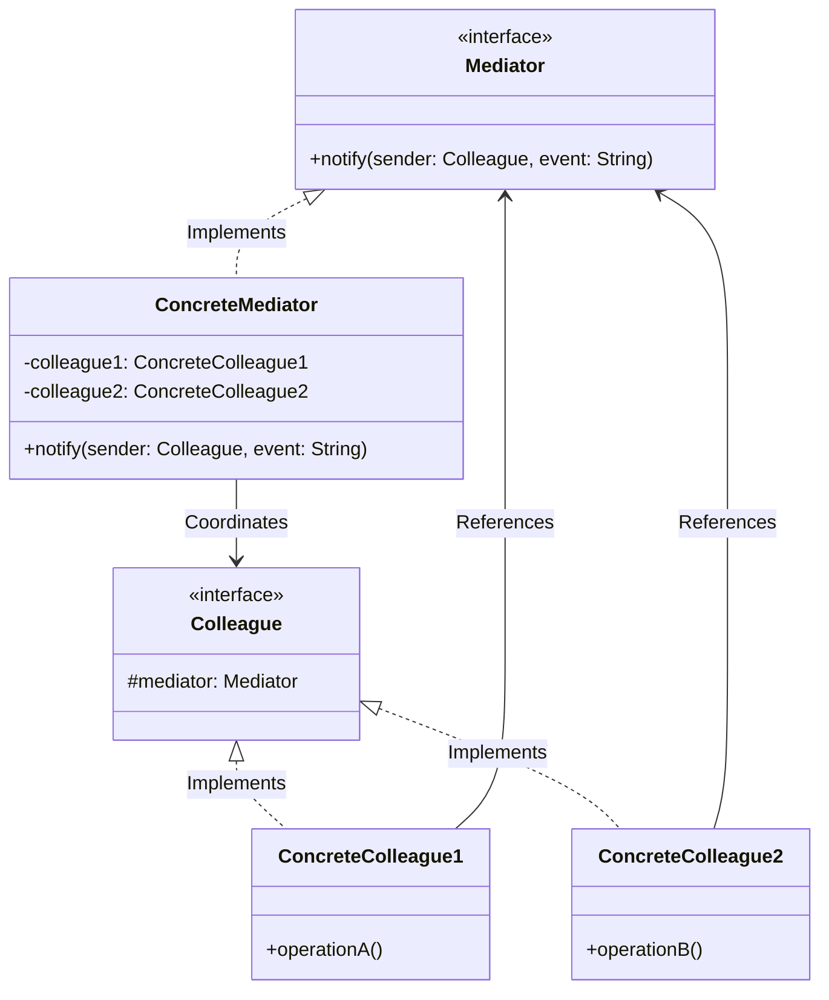
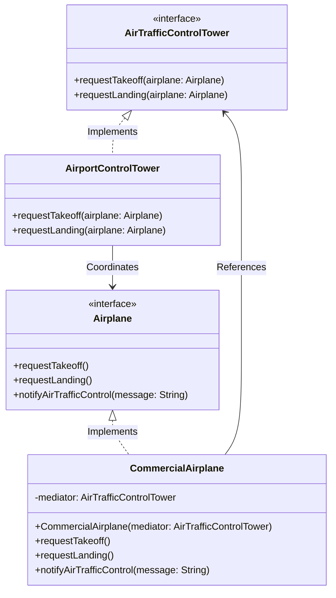

# CS202: Programming Systems (Class 25A02)
## Report 2: The Mediator Design Pattern

**Institution:** VNUHCM - University of Science (HCMUS)  
**Department:** Faculty of Information Technology  
**Course:** CS202 - Programming Systems (25A02)  
**Topic:** Behavioral Design Pattern — Mediator Pattern  
**Document Type:** Technical Seminar & Implementation Report  

---

### Team Members & Role Division

| Student Name | Student ID | Assigned Tasks | Responsibilities & Contribution |
| :--- | :--- | :--- | :--- |
| **Huỳnh Trần Gia Hân** | `25125042` | Tasks 4, 5, 6, 7 | **Lead Report Author & Core Architect:** General & Domain Design, Class Diagrams, Modern C++ Implementation (`MediatorPattern.cpp`). |
| **Trần Thành Lợi** | `25125059` | Tasks 1, 2, 3, 8, 9, 10 | **Problem Analyst & Domain Evaluator:** Problem Statement, Naive Solution (`MediatorNaive.cpp`), Architectural Flaws Analysis, Pros/Cons, Real-World Applications, Interactive Quiz. |

---

## Table of Contents
1. [Real-World Problem Context](#1-real-world-problem-context)
2. [Naive Solution & C++ Implementation](#2-naive-solution--c-implementation)
3. [Architectural Flaws of the Naive Approach](#3-architectural-flaws-of-the-naive-approach)
4. [Theoretical Foundation of the Mediator Pattern](#4-theoretical-foundation-of-the-mediator-pattern)
5. [Generic Mediator Pattern Class Diagram](#5-generic-mediator-pattern-class-diagram)
6. [Domain-Specific Design & ATC Class Diagram](#6-domain-specific-design--atc-class-diagram)
7. [Comprehensive C++ Modern Implementation](#7-comprehensive-c-modern-implementation)
8. [Pros, Cons, and Design Trade-offs](#8-pros-cons-and-design-trade-offs)
9. [Real-World Applications & Industry Use Cases](#9-real-world-applications--industry-use-cases)
10. [Interactive Self-Assessment Quiz](#10-interactive-self-assessment-quiz)

---

## 1. Real-World Problem Context

Consider an Air Traffic Control (ATC) System at a busy commercial airport: Multiple aircraft (commercial flights, cargo carriers, private jets) operate simultaneously in the same terminal airspace, each requiring permissions for takeoff, cruising altitude changes, and runway landings.

The Challenge: If pilots coordinate routes, approach vectors, and runway access by communicating directly with every other pilot in the vicinity, each aircraft must maintain direct links to all other active planes.

The Problem: As air traffic grows, the direct mesh of communications leads to exponential dependency complexity ($O(N^2)$ connections), high collision risks from missed or unsynchronized messages, and inability to reuse aircraft control logic across different airport environments.

---

## 2. Naive Solution & C++ Implementation

A common initial approach to solving this problem without applying behavioral design patterns is to simply let objects keep references to every other object they need to interact with.

### Naive Implementation (`MediatorNaive.cpp`)

```cpp
#include <iostream>
#include <vector>
#include <string>

// In the naive approach, each Aircraft must communicate directly with all other Aircraft.
class Aircraft {
private:
    std::string flightNumber;
    // Each aircraft maintains a list of all other aircraft (direct mesh connections)
    std::vector<Aircraft*> otherAircrafts;

public:
    Aircraft(const std::string& flightNum) : flightNumber(flightNum) {}

    // Add reference to another aircraft (creates the O(N^2) dependency web)
    void addAircraft(Aircraft* aircraft) {
        otherAircrafts.push_back(aircraft);
    }

    std::string getFlightNumber() const {
        return flightNumber;
    }

    // Aircraft attempts to coordinate runway access by communicating with EVERY other plane
    void requestLanding() {
        std::cout << "Aircraft " << flightNumber << " is requesting to land.\n";
        bool canLand = true;
        
        for (Aircraft* other : otherAircrafts) {
            std::cout << "  " << flightNumber << " asking " << other->getFlightNumber() << " for clearance.\n";
            
            // Direct communication to check if the route is clear
            if (!other->giveClearance()) {
                canLand = false;
                break;
            }
        }

        if (canLand) {
            std::cout << "Aircraft " << flightNumber << " has been cleared to land. Landing...\n";
        } else {
            std::cout << "Aircraft " << flightNumber << " cannot land. Airspace is busy.\n";
        }
    }

    // Aircraft processes clearance requests from other planes
    bool giveClearance() {
        // In a more complex scenario, this would check altitude, speed, and trajectory
        std::cout << "    " << flightNumber << " gives clearance.\n";
        return true;
    }
};

int main() {
    Aircraft* flight1 = new Aircraft("Commercial-101");
    Aircraft* flight2 = new Aircraft("Cargo-202");
    Aircraft* flight3 = new Aircraft("PrivateJet-303");

    // The Problem: Setting up the direct mesh of communications
    // As N grows, the number of connections grows at O(N^2).
    // Imagine doing this for hundreds of aircraft!
    
    // Flight 1 needs to know about Flight 2 and 3
    flight1->addAircraft(flight2);
    flight1->addAircraft(flight3);

    // Flight 2 needs to know about Flight 1 and 3
    flight2->addAircraft(flight1);
    flight2->addAircraft(flight3);

    // Flight 3 needs to know about Flight 1 and 2
    flight3->addAircraft(flight1);
    flight3->addAircraft(flight2);

    std::cout << "--- Air Traffic Control (Naive Approach) ---\n\n";

    // Simulating landing coordination
    flight1->requestLanding();
    
    std::cout << "\n---------------------------------------------\n\n";
    
    flight3->requestLanding();

    // Clean up
    delete flight1;
    delete flight2;
    delete flight3;

    return 0;
}
```

---

## 3. Architectural Flaws of the Naive Approach

The naive approach collapses under real-world engineering requirements due to severe structural limitations:

1. **Quadratic Growth of Connections:** For N aircraft, this creates an exponential dependency complexity of $O(N^2)$ connections. This quadratic growth quickly becomes a primary bottleneck for scalability and safety.
2. **Spaghetti Code & High Coupling:** A naive mesh of direct interactions inevitably degrades into "spaghetti code"—a state where every object maintains an intimate awareness of its peers. 
3. **Temporal Coupling:** The timing and side effects of one component's actions are inextricably linked to the internal states of others.

---

## 4. Theoretical Foundation of the Mediator Pattern

In the architectural evolution of scaling systems, managing object communication is a strategic necessity. To achieve enterprise-grade maintainability, architects must centralize interactions, converting a chaotic network into a structured, manageable hub.

The Mediator is a behavioral design pattern that serves this mission by restricting direct communication between objects and forcing them to collaborate exclusively through a single intermediary. By encapsulating side effects and coordination logic within a specialized object, the system transitions from an unmanageable web of dependencies to a streamlined one-to-many model.

### The Four Pillars of the Pattern

The integrity of a Mediator implementation relies on four specific abstractions:

* **Mediator Interface**: Defines the communication contract. It usually declares a generic notification method that allows colleagues to alert the mediator of state changes without knowing who will process the event.
* **Concrete Mediator**: The central coordinator. It encapsulates the intertwined relations between specific components. Critically, the Concrete Mediator often assumes Lifecycle Management responsibilities, handling the instantiation, coordination, and eventual cleanup of the colleagues it manages.
* **Colleague Class/Interface**: The abstraction for components. These objects remain entirely oblivious to the existence or implementation details of their peers, maintaining a reference only to the Mediator interface.
* **Concrete Colleagues**: Specific business logic components. When an event occurs, they notify the mediator. From the colleague's perspective, the subsequent workflow is a "black box," fulfilling the goal of Interface Segregation.

### The Air Traffic Control (ATC) Analogy

The most rigorous conceptual model for this pattern is the Air Traffic Control tower. In a decentralized "mesh" network, every pilot would be required to communicate with every other pilot in the terminal airspace to coordinate approach vectors and landing priorities.

The introduction of the ATC Tower (the Mediator) reduces this complexity to $O(N)$ links. Pilots do not negotiate with each other; they speak only to the tower. The tower enforces constraints and business rules—such as minimum separation and runway sequencing—ensuring that the individual pilots are not overwhelmed by the global state of the airspace. This centralization transforms a high-risk, chaotic system into a scalable operational model where aircraft can be added or removed without reconfiguring the logic of every other plane.

---

## 5. Generic Mediator Pattern Class Diagram



---

## 6. Domain-Specific Design & ATC Class Diagram

To solve the Air Traffic Control problem, we map the Mediator pattern into concrete domain classes:

* **Mediator** -> `AirTrafficControlTower`
* **Concrete Mediator** -> `AirportControlTower`
* **Colleague** -> `Airplane`
* **Concrete Colleagues** -> `CommercialAirplane`, `CargoAirplane`, `PrivateJet`

### UML Class Diagram for ATC Evaluator



---

## 7. Comprehensive C++ Modern Implementation

Below is the modular, clean C++ implementation of the Mediator Pattern for the ATC system.

### Pattern Implementation (`MediatorPattern.cpp`)

```cpp
#include <iostream>
#include <string>
#include <vector>

class Airplane; // Forward declaration

// ==========================================
// 1. Mediator Interface
// ==========================================
class AirTrafficControlTower {
public:
    virtual ~AirTrafficControlTower() {}
    virtual void requestTakeoff(Airplane* airplane) = 0;
    virtual void requestLanding(Airplane* airplane) = 0;
};

// ==========================================
// 2. Colleague Interface
// ==========================================
class Airplane {
protected:
    // Every colleague holds a reference to the mediator
    AirTrafficControlTower* mediator;
    std::string flightNumber;

public:
    Airplane(AirTrafficControlTower* mediator, const std::string& flightNum) 
        : mediator(mediator), flightNumber(flightNum) {}
    virtual ~Airplane() {}

    virtual void requestTakeoff() = 0;
    virtual void requestLanding() = 0;
    
    virtual void notifyAirTrafficControl(const std::string& message) {
        std::cout << "Airplane " << flightNumber << " sends message: " << message << "\n";
    }

    std::string getFlightNumber() const { return flightNumber; }
    
    // Method to allow the mediator to send instructions to this plane
    virtual void receiveInstruction(const std::string& instruction) {
        std::cout << "  -> Airplane " << flightNumber << " receives instruction: " << instruction << "\n";
    }
};

// ==========================================
// 3. Concrete Mediator
// ==========================================
class AirportControlTower : public AirTrafficControlTower {
private:
    // The mediator keeps track of all registered colleagues
    std::vector<Airplane*> airplanes;

public:
    void registerAirplane(Airplane* airplane) {
        airplanes.push_back(airplane);
    }

    // Coordinating takeoff logic
    void requestTakeoff(Airplane* airplane) override {
        std::cout << "[Tower] received takeoff request from " << airplane->getFlightNumber() << ".\n";
        std::cout << "[Tower] checking runway availability and clearing airspace...\n";
        
        // Notify all OTHER airplanes to hold position
        for (Airplane* a : airplanes) {
            if (a != airplane) {
                a->receiveInstruction("Hold position, " + airplane->getFlightNumber() + " is taking off.");
            }
        }
        std::cout << "[Tower] grants takeoff clearance to " << airplane->getFlightNumber() << ".\n\n";
    }

    // Coordinating landing logic
    void requestLanding(Airplane* airplane) override {
        std::cout << "[Tower] received landing request from " << airplane->getFlightNumber() << ".\n";
        std::cout << "[Tower] checking runway availability and clearing airspace...\n";
        
        // Notify all OTHER airplanes to maintain altitude
        for (Airplane* a : airplanes) {
            if (a != airplane) {
                a->receiveInstruction("Maintain altitude, runway is being used by " + airplane->getFlightNumber() + ".");
            }
        }
        std::cout << "[Tower] grants landing clearance to " << airplane->getFlightNumber() << ".\n\n";
    }
};

// ==========================================
// 4. Concrete Colleagues
// ==========================================
class CommercialAirplane : public Airplane {
public:
    CommercialAirplane(AirTrafficControlTower* mediator, const std::string& flightNum) 
        : Airplane(mediator, flightNum) {}

    void requestTakeoff() override {
        std::cout << "Commercial Airplane " << flightNumber << " requesting takeoff.\n";
        // Communication is handed over to the mediator
        mediator->requestTakeoff(this);
    }

    void requestLanding() override {
        std::cout << "Commercial Airplane " << flightNumber << " requesting landing.\n";
        // Communication is handed over to the mediator
        mediator->requestLanding(this);
    }
};

class CargoAirplane : public Airplane {
public:
    CargoAirplane(AirTrafficControlTower* mediator, const std::string& flightNum) 
        : Airplane(mediator, flightNum) {}

    void requestTakeoff() override {
        std::cout << "Cargo Airplane " << flightNumber << " requesting takeoff.\n";
        mediator->requestTakeoff(this);
    }

    void requestLanding() override {
        std::cout << "Cargo Airplane " << flightNumber << " requesting landing.\n";
        mediator->requestLanding(this);
    }
};

class PrivateJet : public Airplane {
public:
    PrivateJet(AirTrafficControlTower* mediator, const std::string& flightNum) 
        : Airplane(mediator, flightNum) {}

    void requestTakeoff() override {
        std::cout << "Private Jet " << flightNumber << " requesting takeoff.\n";
        mediator->requestTakeoff(this);
    }

    void requestLanding() override {
        std::cout << "Private Jet " << flightNumber << " requesting landing.\n";
        mediator->requestLanding(this);
    }
};

// ==========================================
// 5. Client Code
// ==========================================
int main() {
    std::cout << "--- Air Traffic Control (Mediator Pattern Approach) ---\n\n";

    // 1. Create the central Mediator (Control Tower)
    AirportControlTower* tower = new AirportControlTower();

    // 2. Create Colleagues (Airplanes) and link them to the mediator
    CommercialAirplane* flight1 = new CommercialAirplane(tower, "Commercial-101");
    CargoAirplane* flight2 = new CargoAirplane(tower, "Cargo-202");
    PrivateJet* flight3 = new PrivateJet(tower, "PrivateJet-303");

    // 3. Register airplanes with the tower.
    // Notice that airplanes NO LONGER maintain references to each other.
    tower->registerAirplane(flight1);
    tower->registerAirplane(flight2);
    tower->registerAirplane(flight3);

    // 4. Simulate coordinating operations.
    // Airplanes communicate exclusively through the Tower.
    flight1->requestLanding();
    
    std::cout << "---------------------------------------------\n\n";
    
    flight3->requestTakeoff();

    // Clean up
    delete flight1;
    delete flight2;
    delete flight3;
    delete tower;

    return 0;
}
```

---

## 8. Pros, Cons, and Design Trade-offs

Every architectural primitive involves trade-offs. The Mediator pattern does not eliminate complexity; rather, it shifts it. By consolidating interaction logic, we gain modularity at the edges of the system at the cost of increased complexity at the core. A Senior Architect must weigh the benefits of reduced coupling against the risk of creating a new monolithic dependency.

### Evaluative Differentiators

* **Single Responsibility Principle (SRP):** By extracting coordination logic into a dedicated mediator, colleague classes are reduced to their core business functions. This simplifies testing and maintenance.
* **Open/Closed Principle (OCP):** New coordination behaviors or entirely different mediators (e.g., for different regions or UI modes) can be introduced without modifying the existing colleague classes.
* **Coupling Reduction:** The pattern facilitates a fundamental shift from many-to-many to one-to-many relationships, significantly reducing Temporal Coupling and making individual components highly reusable across different contexts.

### The Gray Areas: Mediator vs. Observer

The distinction between Mediator and Observer is often elusive, as Mediators are frequently implemented using the Observer pattern. In such cases, the Mediator acts as the Publisher and the colleagues as Subscribers. However, the Intent is the differentiator: Observer facilitates a distributed, one-way notification of state changes, whereas Mediator centralizes complex, multi-directional coordination. In state-heavy systems, architects must decide if the logic should be distributed (Observer) or encapsulated (Mediator) to prevent "hidden dependencies" where logic is buried within a generic pub-sub bus.

### Critical Limitations and Risks

* **The "God Object" Risk:** The most significant structural risk is that the Mediator evolves into a "God Object"—an over-complex, unmaintainable monolith. To mitigate this, architects should apply strict Interface Segregation to the mediator itself.
* **Performance Bottlenecks:** Routing all high-volume interactions through a single point can introduce latency and represent a single point of failure within a synchronous execution flow.

### Summary of Architectural Trade-offs

| Pros | Cons |
| :--- | :--- |
| **SRP**: Centralizes side-effect management. | **"God Object"**: Risk of creating a complex monolith. |
| **OCP**: Extensible coordination logic. | **Performance**: Potential routing bottlenecks. |
| **Coupling**: Converts O(N^2) links to O(N). | **Abstraction Overhead**: Increases initial boilerplate. |
| **Reusability**: Colleagues are context-oblivious. | **Hidden Dependencies**: Logic can be buried in the mediator. |

These trade-offs are best understood through the lens of modern implementation patterns in full-stack development.

---

## 9. Real-World Applications (Web & Mobile Development)

In modern development, the Mediator pattern is a fundamental building block for state management and navigation, particularly in frameworks designed to handle complex, asynchronous event streams.

### Web Development Implementations

* **Form UI Coordination (The Dialog Box Problem):** Complex web forms often suffer from "inter-component chatter." For example, a "Submit" button may require validation from multiple text fields, while a specific checkbox might toggle the visibility of a "Dependent" field. Rather than having these components reference each other, the Dialog (Mediator) coordinates the state. Components notify the Dialog of events, and the Dialog enforces the business rules, ensuring that UI components remain reusable in different forms.
* **Backend Architecture (CQRS & MediatR):** In the .NET ecosystem, the MediatR library provides a "Request-Response" style of mediation. It enables In-process messaging, decoupling the code that initiates a command from the specific handler that executes the business logic. This is a critical differentiator from "UI Event" style mediation, as it allows for cleaner cross-cutting concerns (logging, validation) without the caller knowing who handles the request.

### Mobile Development Implementations

* **View/Navigation Coordination:** The Router or Coordinator pattern in mobile development serves as a specialized Mediator. Individual View Controllers or Screens notify a Coordinator when a transition (e.g., "User Tapped Login") is required. The Coordinator handles the navigation logic, ensuring screens do not have "Temporal Coupling" to the screens that precede or follow them.

### Distributed Systems

* **Chat Applications:** Server-side mediation is the industry standard for real-time messaging. Instead of peer-to-peer (P2P) connections, clients communicate via a central hub. This hub manages message persistence, delivery status, and routing, enforcing constraints that would be impossible to manage in a decentralized network.

These applications consistently demonstrate the pattern's value in achieving high system modularity and encapsulating the "side effects" of complex interactions.

---

## 10. Interactive Self-Assessment Quiz

Validate your technical understanding of the Mediator pattern by answering the following architectural questions.

### Question 1
**What is the primary architectural intent of the Mediator design pattern?**  
A. To sequentially pass requests along a chain of potential handlers.  
B. To centralize communication between objects to reduce chaotic dependencies and coupling.  
C. To provide a simplified interface to a complex underlying subsystem of objects.  
D. To allow an object to dynamically subscribe to state changes in another object.  

*Answer:* **B** — To centralize communication between objects to reduce chaotic dependencies and coupling.

---

### Question 2
**In a strict Mediator implementation, how should Colleague objects interact with their peers?**  
A. By maintaining private references to the concrete classes of their peers.  
B. By calling public methods on a global singleton instance.  
C. Indirectly, by sending notifications to a mediator through a defined interface.  
D. By accessing a shared data repository or database.  

*Answer:* **C** — Indirectly, by sending notifications to a mediator through a defined interface.

---

### Question 3
**Which of the following is a key responsibility often assumed by a Concrete Mediator?**  
A. Implementing the core business logic of every individual colleague component.  
B. Defining the visual layout and CSS of the user interface.  
C. Managing the lifecycle (instantiation and destruction) and coordination of colleagues.  
D. Ensuring that every colleague is a subclass of the mediator class.  

*Answer:* **C** — Managing the lifecycle (instantiation and destruction) and coordination of colleagues.

---

### Question 4
**According to the Air Traffic Control analogy, what is the impact of moving from a mesh network to a centralized tower?**  
A. It increases the connection complexity from O(N) to O(N^2).  
B. It reduces the connection complexity from O(N^2) to O(N).  
C. It eliminates the need for pilots to use communication interfaces.  
D. It decentralizes the enforcement of terminal airspace constraints.  

*Answer:* **B** — It reduces the connection complexity from O(N^2) to O(N).

---

### Question 5
**What is the primary advantage of shifting from many-to-many to one-to-many object relationships?**  
A. It eliminates the need for any abstraction layers in the system.  
B. It reduces direct and temporal coupling between system components.  
C. It ensures that the system always executes in a purely synchronous manner.  
D. It prevents the use of the Open/Closed Principle.  

*Answer:* **B** — It reduces direct and temporal coupling between system components.

---

### Question 6
**What is the most significant structural risk when a mediator manages too many interactions over time?**  
A. It may break the Single Responsibility Principle by becoming a "God Object."  
B. It will cause a compile-time error due to circular dependencies.  
C. It prevents the mediator from using the Observer pattern for implementation.  
D. It forces all colleague objects to become stateless.  

*Answer:* **A** — It may break the Single Responsibility Principle by becoming a "God Object."

---

## Summary & Group Conclusion
The **Mediator Design Pattern** serves as an indispensable tool for decoupling interactions across complex sub-systems. While it introduces the risk of creating a "God Object," the pattern excels at mitigating unmanageable O(N^2) component dependencies by centralizing routing logic into an O(N) model. Whether for UI dialog orchestration or backend MediatR requests, it ensures a modular and maintainable architectural baseline.
